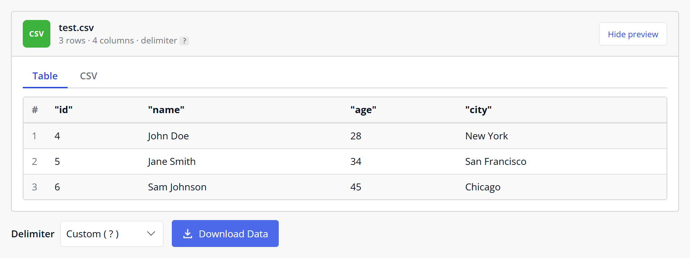
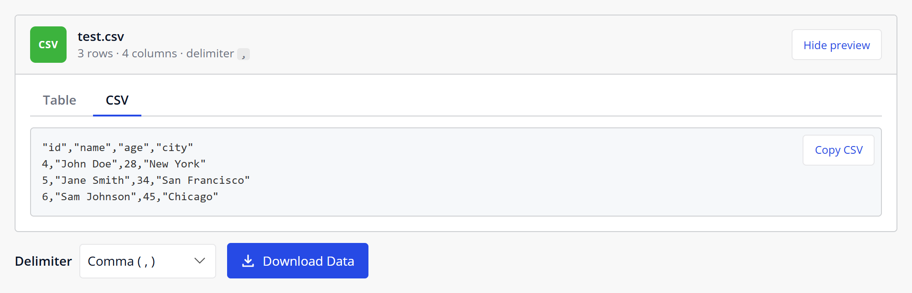

# JSON to CSV

A Mendix pluggable widget that previews JSON data as a table and downloads it as a CSV file.

## Versions

| Widget / GitHub version | Mendix Studio Pro | Notes |
| --- | --- | --- |
| **1.0.1** (`Version1.0.1`) | **10.24.17** | Current — data preview, delimiter selection, bug fixes, React client compatible |
| 1.0.0 (`Version1.0.0`) | 9.24.18 | Previous release |

Download `mendix.JSONtoCSV.mpk` from the [Releases](https://github.com/bharathidas/JSONtoCSV/releases) page. The `mendix.JSONtoCSV.mpk` on `main` is always the latest version (**1.0.1**).

## Features

- **Preview before download** — file name, number of rows and columns, and the delimiter, with:
  - a **Table** tab with paging (rows per page is configurable)
  - a **CSV** tab that shows exactly the text that will be downloaded, with **Copy CSV**
  - **Hide preview / Show preview**
- **Delimiter selection** — a dropdown next to the button: Semicolon, Comma, Tab, Pipe or Other… (any text). It starts with the delimiter attribute, or `;` when that is empty.
- **Clear messages** — loading, no data, invalid JSON (with the parser message), JSON that is not an array, and a warning when `headers` has a different number of names than the data has columns.
- **Download Data** button in your theme's primary button style; the widget's Class and Style settings are applied.

## Properties

### General

- **data** (String attribute, required) — a JSON array of objects, for example `[{"id":1,"name":"Ann"},{"id":2,"name":"Bob"}]`.
- **filename** (String attribute) — the file name. `.csv` is added if the name does not end with it. Default is `export.csv`.
- **delimiter** (String attribute) — the field separator. Default is `;`.
- **headers** (String attribute) — comma-separated column names for the first line of the CSV, for example `ID, Name`. They only relabel the columns; the columns and their order come from the keys of the first object. When empty, the keys are used.
- **Allow delimiter selection** (default Yes) — show the delimiter dropdown. Set to No to always use the delimiter attribute.

### Preview

- **Show preview** (default Yes) — show the preview card above the button.
- **Rows per page** (default 10) — number of rows per page in the Table tab.

## Usage

1. Add `mendix.JSONtoCSV.mpk` to the `widgets` folder of your app and press **F4** (Synchronize App Directory) in Studio Pro.
2. Add an entity with a String attribute (unlimited length) for the JSON data, and optionally attributes for the file name, delimiter and headers.
3. Place the **JSONto CSV** widget in a data view of that entity and select the attributes.
4. Fill the data attribute, for example with a microflow that exports objects with an export mapping.

**Upgrading from 1.0.0:** replace the `.mpk`, press F4, and choose **Update all widgets** when Studio Pro reports that the widget definition has changed.

## What's fixed in 1.0.1

- The **delimiter** attribute is used. In 1.0.0 the delimiter was read from the filename attribute.
- With empty **headers**, the JSON keys are used as column names. In 1.0.0 the first line of the CSV was blank.
- With empty data, the button is disabled. In 1.0.0 it downloaded three hard-coded demo rows.
- Invalid JSON shows a message. In 1.0.0 it crashed the widget.
- Works in the Mendix 10 React client. 1.0.0 failed there with "require is not defined".

## Dependencies

- Mendix Studio Pro **10.24.17** (widget **1.0.1**)
- Mendix Studio Pro 9.24.18 (widget 1.0.0 — see release `Version1.0.0`)

## Development

The widget source is in [`jsontocsv/`](jsontocsv). Run `npm install` and `npm run release` in that folder; the package is written to `jsontocsv/dist/1.0.1/`.

## Issues, suggestions and feature requests

https://github.com/bharathidas/JSONtoCSV/issues
